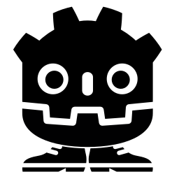

# gdstomp

<p align="left">
  
</p>

Godot 4 addon for accessing messaging servers using the [STOMP (1.2)](https://stomp.github.io) protocol.

## Quick start

Source code for quick start with `RabbitMq` you can find [here in examples](/addons/gdstomp/examples/RabbitMqExample.gd).

```gdscript
var stomp_client: STOMPClient = STOMP.over_tcp()

func _ready() -> void:
  var connect_error: int = stomp_client.connect_to_host("127.0.0.1:61613")
  
  if connect_error != OK:
    push_error("connection error: %s" % connect_error)
  
  await stomp_client.connection.connected;
  stomp_client.send(STOMPPacket.connection("/", "admin", "admin"))
  var connected_packed: STOMPPacket = await stomp_client.received;
  stomp_client.send(STOMPPacket.to("/queue/test").with_message("Hello, World!"))

func _process(delta: float) -> void:
  stomp_client.poll();
```

## Usage

Create STOMP Client over tcp:

```gdscript
var stomp_client: STOMPClient = STOMP.over_tcp()
```

Establish connection to message broker:

```gdscript
var connect_error: int = stomp_client.connect_to_host("127.0.0.1:61613")
if connect_error != OK:
  push_error("connection error: $s" % connect_error)
```


> [!WARNING]
> You need poll STOMP client every frame (or less often) for receive or transceive packets.  
> Process method in nodes is good place for it.

```gdscript
func _process(delta: float) -> void:
  stomp_client.poll()
```

Before send any packets wait until connection:

```gdscript
await stomp_client.connection.connected;
```

## Sending and receiving messages

After established connection you can connect to broker. Use default `send` method:

```gdscript
stomp_client.send(STOMPPacket.connection("/", "admin", "admin"))
var connected_answer: STOMPPacket = await stomp_client.received
```

Or use specific method `send_connection`:

```gdscript
stomp_client.send_connection("admin", "admin", "/")
var connected_answer: STOMPPacket = await stomp_client.received
```

So after this you can send message to queues:

```gdscript
var hello_packet: STOMPPacket = STOMPPacket.to("/queue/test").with_message("Hello, World!")
stomp_client.send(hello_packet)
```

## Callbacks

By default, the Stomp client will convert **all** received data into a STOMPPacket in received signal that you can connect to.

```gdscript
func _ready() -> void:
  stomp_client.received.connect(_on_received_stomp_packet)

func _on_received_stomp_packet(packet: STOMPPacket) -> void:
  # do something...
```

But If you want to filter received data by a specific queue, use `listen` and `unlisten` methods:

```gdscript
stomp_client.listen("/queue/test", _on_received_stomp_packet)
```

## Websockets

You can use this addon for websocket connection (for WebGL projects, in example). Just use another builder:

```gdscript
var stomp_client: STOMPClient = STOMP.over_websockets();
```

Using websocket may require additional customizations. For example, handshake headers or tls options. You can pass them as method arguments:

```gdscript
var handshake_headers: PackedStringArray = ["header-1", "header-2"]
var tls_options: TLSOptions = TLSOptions.client_unsafe()
var stomp_client: STOMPClient = STOMP.over_websockets(handshake_headers, tls_options)
```

And remember that the connection string for websockets is usually different from TCP:

```gdscript
stomp_client.connect_to_host("ws://192.168.100.157:15674/ws")
```

It's all. Working with websockets is no different from TCP further.
